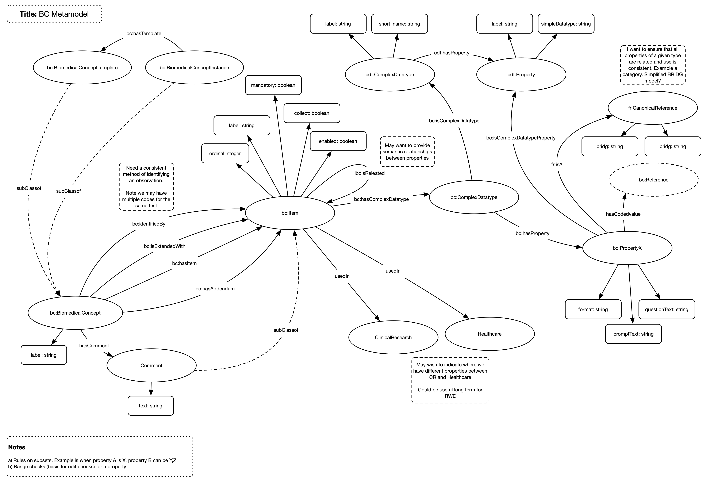

# Canonical Reference

## Overview

This is a sub section of the BC model and details an implementation of a reference framework. Tis framework allows for links across silos by allowing items to identify themselves as an atomic thing.

## Model

## Nodes

The nodes within the model are implemented:

| **Node** | **Description** |
| --- | --- |
| **CanonicalReference** | A reference |

## Relationships

The following relationships are implemented:

| **Relationship** | **Description** | **Cardinality** |
| --- | --- | --- |
| **isA** | Links any concept to a reference. A concept should only be linked to one reference | 1:1 |

## Enhancements

