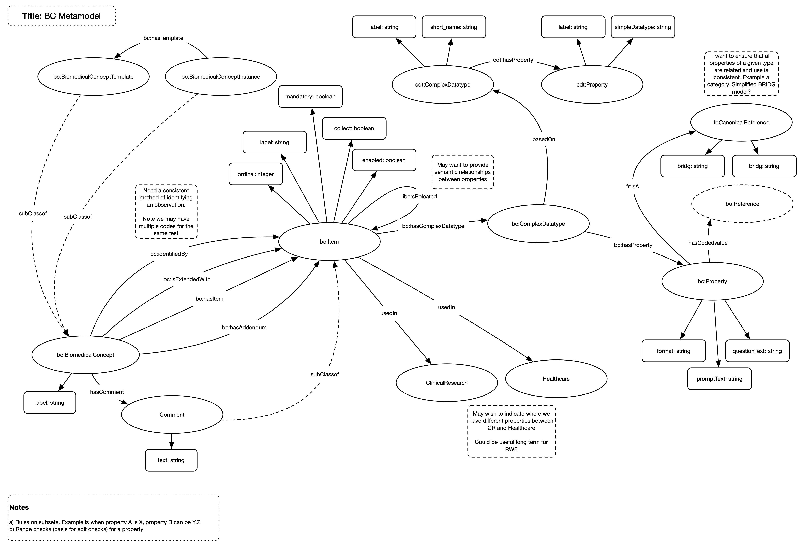

# Complex Datatypes

## Overview

This is a sub section of the BC model and details an implementation of complex datatypes used by BCs

## Model

## Nodes

The nodes within the model are implemented:

| **Node** | **Description** |
| --- | --- |
| **ComplxtDatatype** | A complex datatype |
| **Property** | A property of a complex datatype |

## Relationships

The following relationships are implemented:

| **Relationship** | **Description** | **Cardinality** |
| --- | --- | --- |
| **hasProperty** | Links a datatype to its properties | 1:M |

## Enhancements

