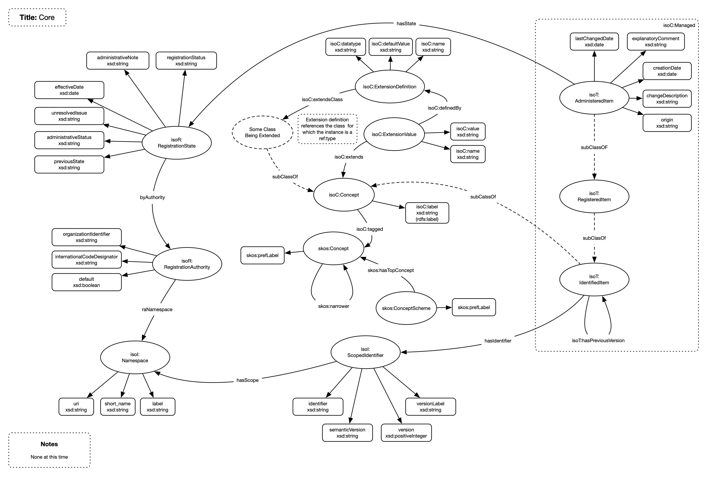

# Core

## General

The core compoenents are tasked with implementing ownership and version management for those items maintained within the repository. This includes

1. Namespaces
1. Registration Authorities
1. Concept
1. Managed Item

Much of the implementation is based upon the ISO 11179 MDR standard

## Model

## Nodes

| **Node** | **Description** |
| --- | --- |
| **AdministeredItem** | The managed item |
| **Concept** | The core concept from which all items are built |
| **ScopedIdentifier** | Holds the identification of a managed item |
| **RegistrationState** | Holds the state infomration for a managed item |
| **RegistrationAuthority** | Details an organisation that owns managed items |
| **Namespace** | The scoping namespace for an scoped identifier |

## Relationships

| **Relationship** | **Description** | **Cardinality** |
| --- | --- | --- |
| **hasState** | Links an AdministeredItem to its RegistrationState | 1:1 |
| **hasIdentifier** | Links an AdministeredItem to its ScopedIdentifier | 1:1 |
| **hasScope** | Links a ScopedIdentifier to its scoping Namespace | 1:1 |
| **hasNamespace** | Links a RegistrationAuthority to its scoping namespace | 1:1 |
| **tagged** | Links a Concept to a tag | 1:m |

## Namespaces

Namespaces are used to scope identifiers within the repository. A managed item is identified by an identifier and the Registration Authority (RA) that owns it with the identifier being unique within the RA. The namespace belongs to the RA and is the class that scopes the identifier to a RA.

## Registration Authority (RA)

The RA is the organization that owns a particular item. The RA has 1 or more namespaces to scope identifiers

## Concept

The core building block of the repository with all items being built from one or more concepts. The concepts implements

1. A label
1. Can be tagged

## Managed Item

A managed item is a concept with an attached:

1. Scoped Identifier containing the identifier and version information for the item
1. Registration Status containing the current state of the item

The combination results in item that has a unique identifier and state

## Scoped Identifier

Contains the identifier, version and the namespace scoping the identifier thus ensuring it is unique

## Registration Status

Contains the registration status for an item

## Tags

A Concept can be linked to one or more tags

## Extensions

Not implemented.
