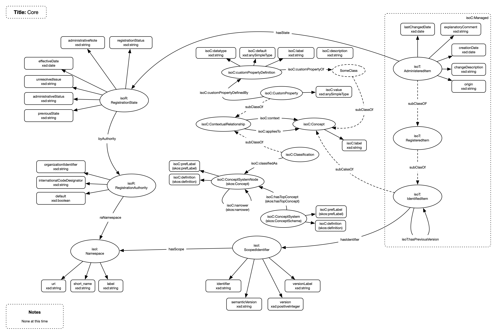
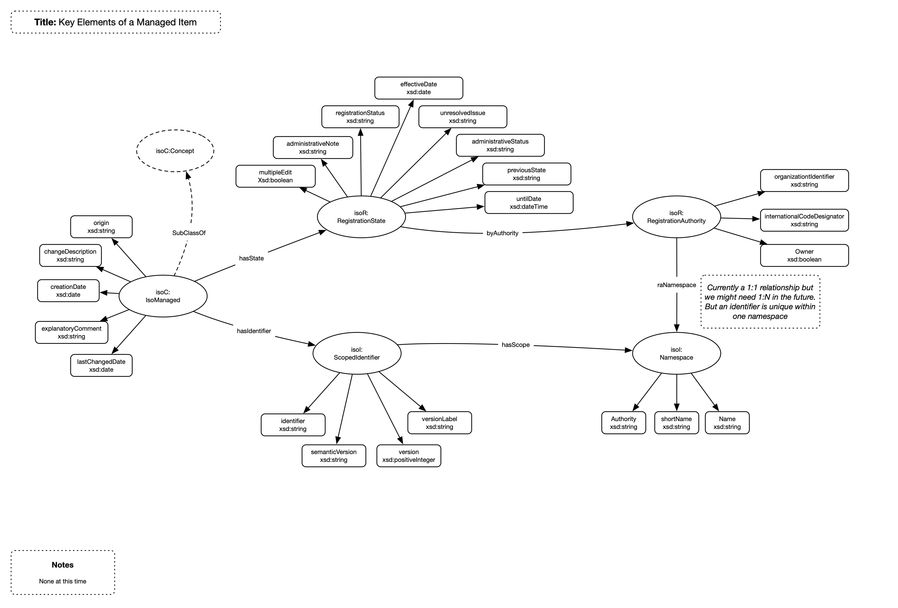

# Core

## General

The core compoenents are tasked with implementing ownership and version management for those items maintained within the repository. This includes

1. Namespaces
1. Registration Authorities
1. Concept
1. Managed Item

Much of the implementation is based upon the ISO 11179 MDR standard

## Model

## Nodes

| **Node** | **Description** |
| :--- | :--- |
| **AdministeredItem** | An item managed (owned) by the repository |
| **RegisteredItem** | An item registered in the repository  |
| **IdentifiedItem** | An item identified in the repository  |
| **Concept** | The core concept from which all items are built |
| **ScopedIdentifier** | Holds the identification of a managed item |
| **RegistrationState** | Holds the state infomration for a managed item |
| **RegistrationAuthority** | Details an organisation that owns managed items |
| **Namespace** | The scoping namespace for an scoped identifier |

## Relationships

| **Relationship** | **Description** | **Cardinality** |
| :--- | :--- | :--- |
| **hasState** | Links an AdministeredItem to its RegistrationState | 1:1 |
| **hasIdentifier** | Links an AdministeredItem to its ScopedIdentifier | 1:1 |
| **hasScope** | Links a ScopedIdentifier to its scoping Namespace | 1:1 |
| **hasNamespace** | Links a RegistrationAuthority to its scoping namespace | 1:1 |
| **tagged** | Links a Concept to a tag | 1:m |

## Namespaces

Namespaces are used to scope identifiers within the repository. A managed item is identified by an identifier and the Registration Authority (RA) that owns it with the identifier being unique within the RA. The namespace belongs to the RA and is the class that scopes the identifier to a RA.

## Registration Authority (RA)

The RA is the organization that owns a particular item. The RA has 1 or more namespaces to scope identifiers

## Concept

The core building block of the repository with all items being built from one or more concepts. The concepts implements

1. A label
1. Can be tagged

## Managed

### General

A managed item is a concept with an attached:

1. Scoped Identifier (SI) containing the identifier and version information for the item
1. Registration Status (RS) containing the current state of the item

The combination results in item that has a unique identifier and state. The Managed Item is a combination of an Administered, Registered and Identifier item. These are not distinguished currently in the implementation.

### Storage

Managed items are stored as differences. 

### Set Initial Version

This creates the necessary SI and RS setting up the necessary versioning, identifier and status.

### Set Import Version

Sets the SI and RS to a state for an imported item

### Create Next Version

When a managed item is edited it may be necessary to create a new version (see Registration Status section) and thus copy the exisiting version. Given that items are stored as differences not everything needs to be copied, just the top level node pointing to the exisitng children nodes is sufficiebt. 

A standard clone operation should be provided by each managed item type to perform this operation. This operation should inherit from super classes and should ensure that sufficient information is copied for the type.

The creation of a new version should also handle the versioning etc.

## Scoped Identifier

Contains the identifier, version and the namespace scoping the identifier thus ensuring it is unique

## Registration Status

### General

Contains the registration status for an item and controls what actions can be performed on the managed item

### Edit and Status

The following table defines the permitted actions when in the specified state.

| In State | Can Update State?  | New Version on Edit? | Can Update Label? | Can Make Current? | Can Delete? |
| -| :-: | :--: | :-: | :-: | :-: |
| Not Set       | Not applicable (NA) | NA | NA | NA | NA |
| Incomplete    | :heavy_check_mark: | :x: | :heavy_check_mark: | :x: | :heavy_check_mark: |
| Candidate     | :heavy_check_mark: | :heavy_check_mark: | :heavy_check_mark: | :x: | :x: |
| Recorded      | :heavy_check_mark: | :heavy_check_mark: | :heavy_check_mark: | :x: | :x: |
| Qualified     | :heavy_check_mark: | :heavy_check_mark: | :heavy_check_mark: | :x: | :x: |
| Standard      | :heavy_check_mark: | :x: | :heavy_check_mark: | :heavy_check_mark: | :x: |
| Retired       | :heavy_minus_sign: | :heavy_minus_sign: | :heavy_minus_sign: | :heavy_minus_sign: | :x: |
| Superseded    | :x: | :x: | :heavy_check_mark: | :x: | :x: |

## Tags

A Concept can be linked to one or more tags

## Extensions

Not implemented.

## Additional Information

The pattern shown in the above diagram as every managed item within the repository follows it. The managed item has a header node (IsoManaged) that has a registration state (hasState relationship) and an identifier (hasIdentifier). The registration state is managed (byAuthority) by an Registration Authority (RA) that has a namespace (raNamespace). The Scoped Identifier holds an identifier, and version info, that is unique within the scope (hasScope) of a namespace that belongs the RA.

The ownership of an item (the RA) dictaes whethr the item can be edited or just referred to. Ownership should be accessed via the RA. Identification and version info should be accessed via the Scoped Identifier

## Issues

1. Need to ensure that an RA can have multiple Namespaces

