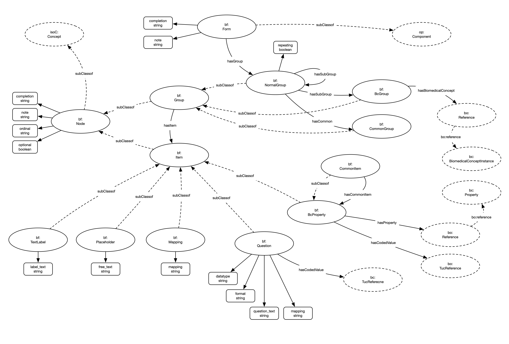

# Forms

## Overview

This model details the mechanism by which Forms are structured within the model

## Model

## Nodes

The nodes within the model are implemented:

| **Node** | **Description** |
| --- | --- |
| **Form** | Core Form Class |
| **Group** | Generic group |
| **NormalGroup** | Normal group |
| **CommonGroup** | A common group |
| **Item** | An item within a Form |
| **Placeholder** | Placeholder item |
| **TextLabel** | A passive text label item |
| **Mapping** | A passive mapping item |
| **BcProperty** | A form question based upon a Biomedical Concept property |
| **Question** | A form question |
| **CommonItem** | A common item |

Nodes not noted in the above table have not been implemented as yet.

## Relationships

The following relationships are implemented:

| **Relationship** | **Description** | **Cardinality** |
| --- | --- | --- |
| **hasGroup** | Links a Form to its groups | 1:M |
| **hasItem** | Links a group toits items | 1:M |
| **hasCommon** | Has a common group relationship | 1:M |
| **hasCommonItem** | Has a common item relationship | 1:M |
| **hasSubGroup** | Has a sub group relationship | 1:M |
| **hasBiomedicalConcept** | Reference to a Biomedical Concept | 1:M |
| **hasProperty** | Reference to a Biomedical Concept property | 1:M |
| **hasThesaurusConcept** | Reference to a Thesaurus Concept | 1:M |
| **hasCodedValue** | Reference to a coded value | 1:M |

Relationships not noted in the above table have not been implemented as yet.

## Enhancements

1. Form needs to be improved by being an operational item (managed item)