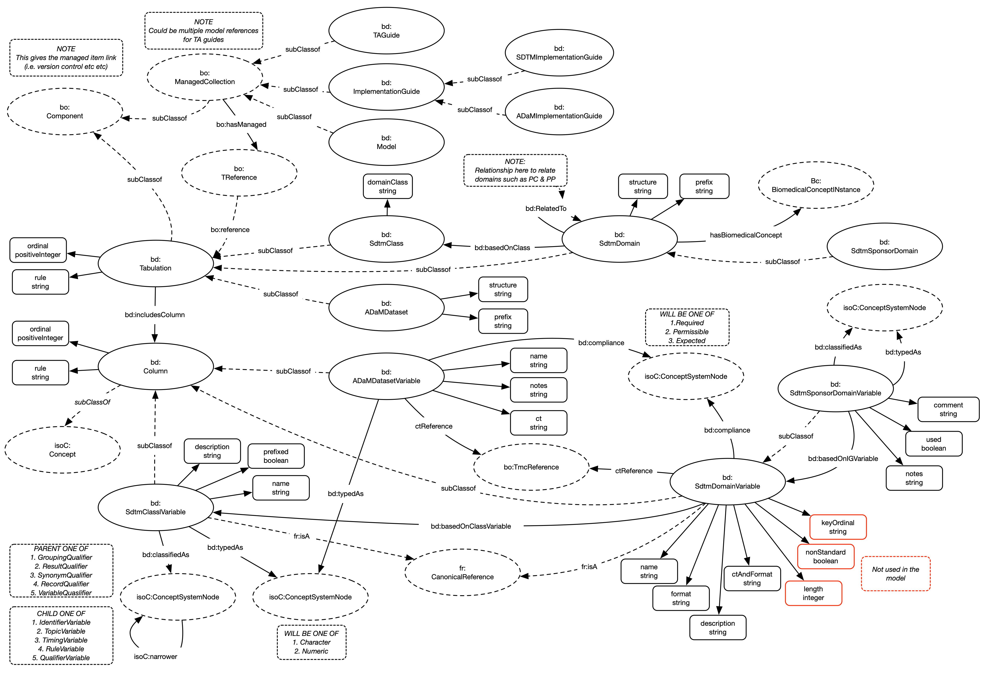

# Tabulation

## Overview

This model details the mechanism by which Tabulations are structured within the model

## Model

## Nodes

The nodes within the model are implemented:

| **Node** | **Description** |
| --- | --- |
| **Tabulation** | A tabulation. A set of columns. The most generic form of a table |
| **Column** | Column within a tabulation. The most generic form. |
| **Model** | A document published detailing a model |
| **SdtmClass** | A SDTM class. Building block for a SDTM domain |
| **SdtmClassVariable** | A SDTM class variable. Building block for a SDTM variable |
| **SdtmDomain** | A domain as defined within a SDTM implementation guide |
| **SdtmDomainVariable** | A variable as defined within a SDTM implementation guide |
| **AdamDataset** | A dataset as defined within an ADaM implementation guide |
| **AdamDatasetVariable** | A variable as defined within an ADaM implementation guide |
| **ImplementationGuide** | A document published as a implementation guide |
| **SDTMImplementationGuide** | A document published as a SDTM implementation guide |
| **ADaMImplementationGuide** | A document published as a ADaM implementation guide |

Nodes not noted in the above table have not been implemented as yet.

## Relationships

The following relationships are implemented:

| **Relationship** | **Description** | **Cardinality** |
| --- | --- | --- |
| **includesColumn** | Relates columns to tabulations | 1:M |
| **basedOnClass** | Notes which domain class a domain is based on | 1:M |
| **basedOnClassVariable** | Notes which domain class variable a variable is based on | 1:M |
| **classifiedAs** | The variable classification | 1:M |
| **typedAs** | The variable datatype | 1:M |
| **compliance** | The variable compliance | 1:M |
| **hasBiomedicalConcept** | Reference to a Biomedical Concept  | 1:M |
| **hasCodeList** | Reference to a Code List. Points to the version relevant at the time the variable was issued | 1:M |

Relationships not noted in the above table have not been implemented as yet.

## Notes

All domains and classes are managed items.
All IGs and Models are managed collections.
All will be stored as differences.

## Enhancements

1. Rules should be implemented as nodes and relationships
1. ConceptSystemNodes should be implemeted as terminologies