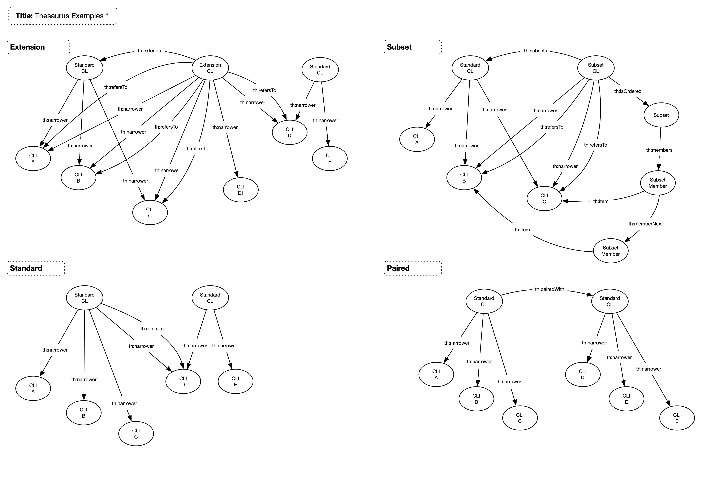

# Terminology (Thesaurus)

## Overview

This model details how terminologies are stored and constructed. The model is based on the W3C SKOS standard but has also taken into consideration the ISO 25964 standard.

Three levels of information are modelled

1. Terminology - A complete terminology that is named and version managed. Referred to as a thesaurus.
1. Code List - A set of terms. Named and version managed. Referred to as a Managed Concepts
1. Code List Item - An item within a code list. Not version managed. Referred to as Unmanaged Concepts

## Model

## Nodes

| **Node** | **Description** |
| --- | --- |
| **Thesaurus** | The managed item representing a terminology |
| **ManagedConcept** | A concept within the terminology. This concept is a managed item thus has state and a version |
| **UnmanagedConcept** | A concept within the terminology. This concept is not version managed |
| **Subset** | Head of the ordered list for a subset |
| **SubsetMember** | Member of a subset list |
| **RankedCollection** | Head of the ranked list |
| **RankMember** | Member of a ranked list |

## Relationships

| **Relationship** | **Description** | **Cardinality** |
| --- | --- | --- |
| **isTopConceptReference** | Links a thesaurus with the child concept references | 1:M |
| **isTopConcept** | Links a thesaurus with the child concepts. Placed there for compatability with SKOS | 1:M |
| **reference** | Links a thesaurus to a reference terminology | 1:1 |
| **baselineReference** | Links a thesaurus to the baseline reference terminology | 1:1 |
| **extends** | Links a thesaurus concept with the managed concept that it is extending | 1:1 |
| **subsets** | Links a thesaurus concept with the managed concept that it is subsetting | 1:1 |
| **pairedWith** | Links a thesaurus concept (parent) with the managed concept (child) that it is paired with | 1:1 |
| **isOrdered** | Links a thesaurus concept with the ordered list | 1:1 |
| **isRanked** | Links a thesaurus concept with the ranking list | 1:1 |
| **narrower** | Links a thesaurus concept with the child concepts | 1:M |
| **refersTo** | Used to indicate that the item is referenced from another collection of concepts. Can only edit the child if parent does not have a refersTo relationship | 1:M |

## Examples

## Standard Code Lists

Standard code lists are those that contain items created solely for this code list or references to items from other code lists. The refersTo relatinship indicates the difference, see the examples diagram above. Standard code lists may be owned or imported.

## Extensions

Extended code lists are those code lists that are owned that extend code lists owned by other organisations with codes from other code lists. Extensions allow for items to be created and referred to.

See the example diagrams above.

## Subsets

Subsets are those code lists formed from a subset of items from a single other code list and that are placed in some order. All items are referenced, new items cannot be created within a subset.

See the example diagrams above.

## Ranked

A ranked code list is one that has a rank value associated with each item within it.

See the example diagrams above.

## Paired

### General

A paired code list is one where there is a TEST/TESTCD type of relationship between the two code lists. Operations available are:

### Functionality

1. Pair the code lists
1. Unpair the code lists
1. Code list paired? Consider this from both ends of the pairing
1. Code list paired as the parent?
1. Code list paired as the child?
1. Indicator that the code list is paired
1. Access either code list in a pair from the other

### Business Rules

The existance of the pairedWith relationship denotes the pairing. The TESTCD code list should refer to the TEST code list (i.e. the TESTCD is the "parent").

Pairing should only be permitted when

1. Names are related by a configured set of names:
  1. --TEST & --TESTCD 
  1. --TS & --TSCD
  1. --TC & --TN
  1. Similar pairings
1. Note that -- may not be just two characters, some CDISC code lists do not match the rules

Terms can be equated when:

1. Definition matches

## Enhancements

1. Make ordered a feature of any code list.
1. Multiple level code lists.
1. Improve SKOS generic functionality.
1. Manual identifiers.
1. Multi level terminology