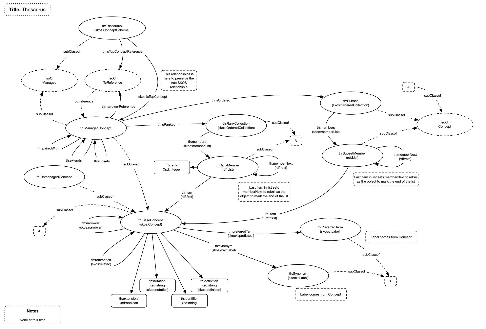

# Terminology (Thesaurus)

## Overview

This model details how terminologies are stored and constructed. The model is based on the W3C SKOS standard but has also taken into consideration the ISO 25964 standard.

Three levels of information are modelled

1. Terminology - A complete terminology that is named and version managed. Referred to as a thesaurus.
1. Code List - A set of terms. Named and version managed. Referred to as a Managed Concepts
1. Code List Item - An item within a code list. Not version managed. Referred to as Unmanaged Concepts

## Model

## Nodes

| **Node** | **Description** |
| --- | --- |
| **Thesaurus** | The managed item representing a terminology |
| **ManagedConcept** | A concept within the terminology. This concept is a managed item thus has state and a version |
| **UnmanagedConcept** | A concept within the terminology. This concept is not version managed |
| **Subset** | Head of the ordered list for a subset |
| **SubsetMember** | Member of a subset list |
| **RankedCollection** | Head of the ranked list |
| **RankMember** | Member of a ranked list |

## Relationships

| **Relationship** | **Description** | **Cardinality** |
| --- | --- | --- |
| **hasConcept** | Links a thesaurus to the top-level concepts | 1:M |
| **hasChild** | Links a thesaurus concept with the child concepts | 1:M |

## Standard Code Lists

Standard code lists are those that contain items created solely for this code list or references toitems from other code lists

_Further details required_

## Extensions

Extended code lists are those code lists that are owned that extend code lists owned by other organisations with codes from other code lists. Extensions allow for items to be created.

_Further details required_

## Subsets

Subsets are those code lists formed from a subset of items from a single other code list and that are placed in some order

_Further details required_

## Ranked

A ranked code list is one that has a rank value associated with each item within it.

_Further details required_

## Paired

A paired code list is one where there is a TEST/TESTCD relationship between the two code lists. Operations available are:

1. Pair the code lists
1. Unpair the code lists
1. Code list paired? Consider this from both ends of the pairing
1. Code list paired as the parent?
1. Code list paired as the child?
1. Indicator that the code list is paired
1. Access either code list in a pair from the other

The existance of the pairedWith relationship denotes the pairing. The TESTCD code list should refer to the TEST code list (i.e. the TESTCD is the "parent")

## Enhancements

1. Make ordered a feature of any code list.