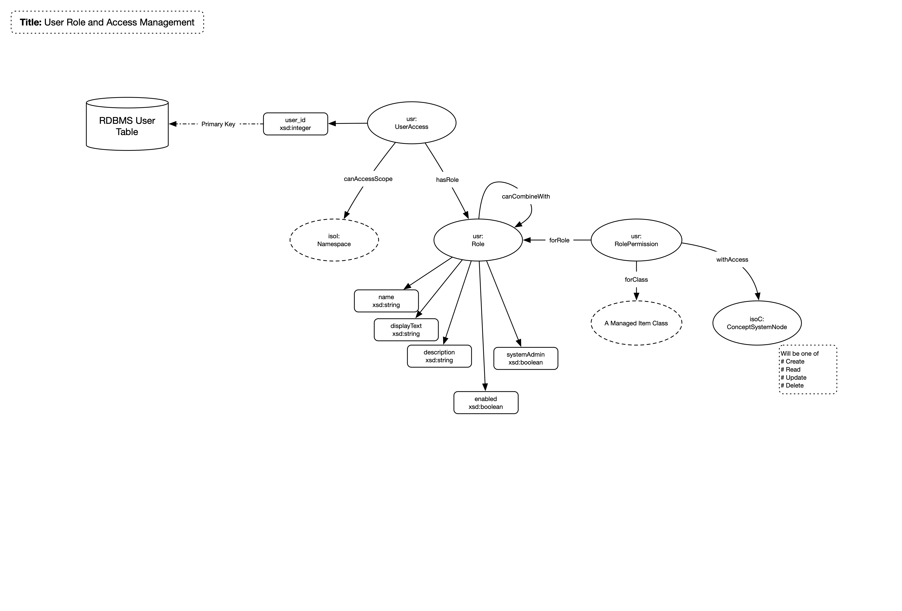

# User and Role Management

## General

User management and access control is provided by a combination of a Rails Gem and bespoke controls

The **Devise** gem is used for user management and login, See [https://github.com/plataformatec/devise](https://github.com/plataformatec/devise), 
while rols and authroization to system functionality is controlled by application software. The use of Pundit and Roify has been discontinued since R4.0.0.

A small wrapper is placed around these to implement user login, logout, password management, roles and authorisation to system functions. Devise handles the bulk of the work with an associated class User to provide some basic user management (create, delete and amend users). 

## Model

## Nodes

| **Node** | **Description** |
| :--- | :--- |
| **UserAccess** | Links the permitted namespaces (scopes) and roles a user has permissions (access) for. Links to the RDBMS user definition managed by Devise |
| **Role** | The definition of a role  |
| **RolePermission** | Specifies the permission, a combination of a class and the type access (CRUD operation) |

## Relationships

| **Relationship** | **Description** | **Cardinality** |
| :--- | :--- | :--- |
| **canAccessScope** | Links a user with a scope | 1:M |
| **hasRole** | Links a user with a role | 1:M |
| **forRole** | Links a permission to a role | 1:M |
| **forClass** | Links a permission to a RDF class | 1:1 |
| **withAccess** | Links a permission to an access type | 1:1 |

## Roles 

Roles allow for access to one or more system application classes for either a Create, Read, Update or Delete operation (CRUD) or a combination thereof. 

## Controller Action Authentication and Authorisation

All controller actions should be authenticated (valid user) and authorised (user can perform function given their role). The authentication of users is provided by the Devise gem.

## Notes

1. So as to enable Audit Trail logging the devise session controller is extended

